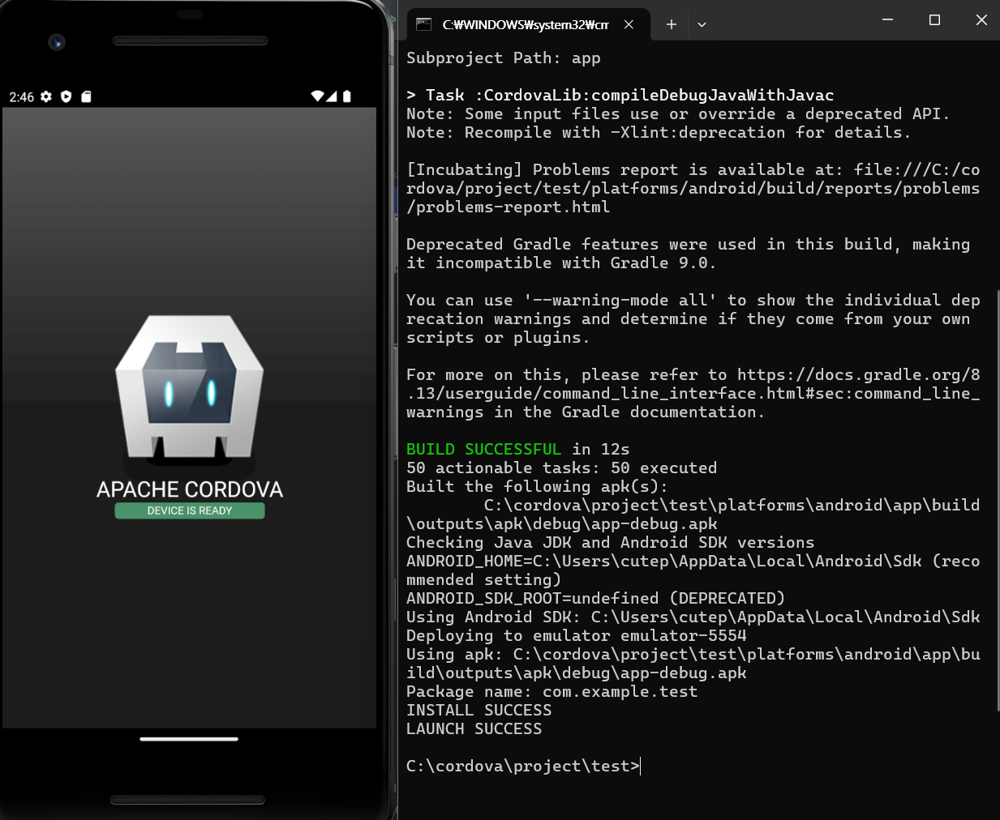

# Cordova 개발환경 설정 가이드 📱

Apache Cordova를 사용한 하이브리드 앱 개발 환경 구축 가이드입니다.

## 📋 설치 순서

### 1. Node.js 설치
- [Node.js 공식 사이트](https://nodejs.org/)에서 LTS 버전 다운로드 및 설치

### 2. Cordova 설치
```bash
npm install cordova -g
cordova -v  # 버전 확인
```

### 3. JDK 23 설치
- [Oracle JDK 23](https://www.oracle.com/java/technologies/downloads/#java23) 다운로드 및 설치

### 4. Gradle 설치
- [Gradle 공식 사이트](https://gradle.org/install/)에서 v8.10 binary-only 다운로드
- 압축 해제 후 `C:\cordova\gradle-8.10` 위치에 설치

### 5. Android Studio 설치
- [Android Studio](https://developer.android.com/studio?hl=ko) 다운로드 및 설치

## ⚙️ SDK 설정

### SDK Platforms
- Android 13.0 ✅
- Android 12.0 ✅  
- Android 11.0 ✅

### SDK Tools
- Android SDK Build-Tools (34.0.0, 33.0.2, 33.0.1, 33.0.0, 32.0.0, 31.0.0) ✅
- Android Emulator ✅
- Android SDK Platform-Tools ✅
- Android SDK Command-line Tools (latest) ✅

## 🌍 환경변수 설정

```
JAVA_HOME = C:\Program Files\Java\jdk-23
ANDROID_HOME = C:\Users\[USERNAME]\AppData\Local\Android\Sdk
GRADLE_HOME = C:\cordova\gradle-8.10
```

**Path 추가:**
```
C:\Users\cutep\AppData\Local\Android\Sdk\build-tools
C:\Users\cutep\/AppData\Local\Android\Sdk\cmdline-tools\latest\bin
C:\Users\cutep\AppData\Local\Android\Sdk\platform-tools
C:\cordova\gradle-8.10\bin
```

## 📱 프로젝트 생성 및 실행

### 에뮬레이터 설정
1. Android Studio → Tools → Device Manager
2. Create device → Pixel 2 → R system image 다운로드

### Cordova 프로젝트 생성
```bash
cd \cordova
md project
cd project
cordova create test com.example.test testApp -d
cd test
cordova platform add android
```

### 앱 실행
```bash
cordova run --emulator
# 또는
cordova emulate android
```

## 🎉 설치 완료!

> 모든 설정이 완료되면 에뮬레이터에서 Cordova 앱이 성공적으로 실행됩니다!

---

**📸 성공 스크린샷**


*에뮬레이터에서 실행된 첫 Cordova 앱*

> **Made with 📱 Apache Cordova**
